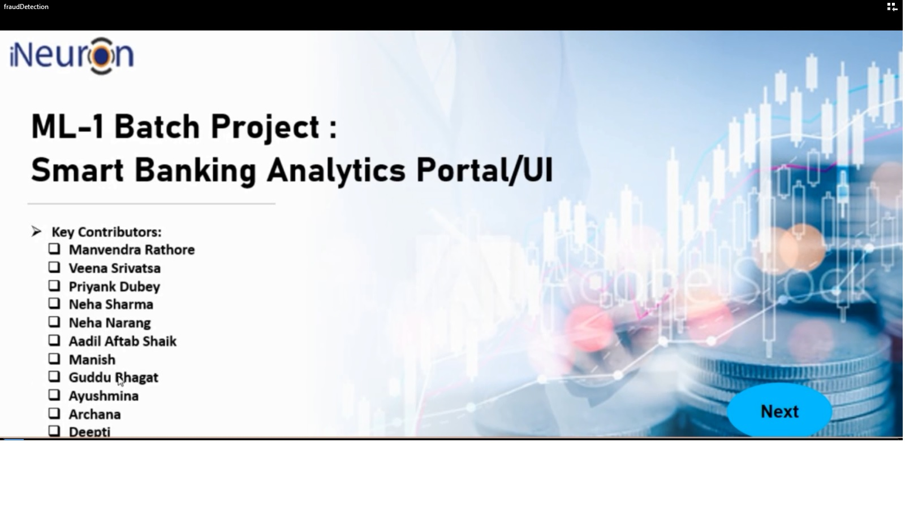
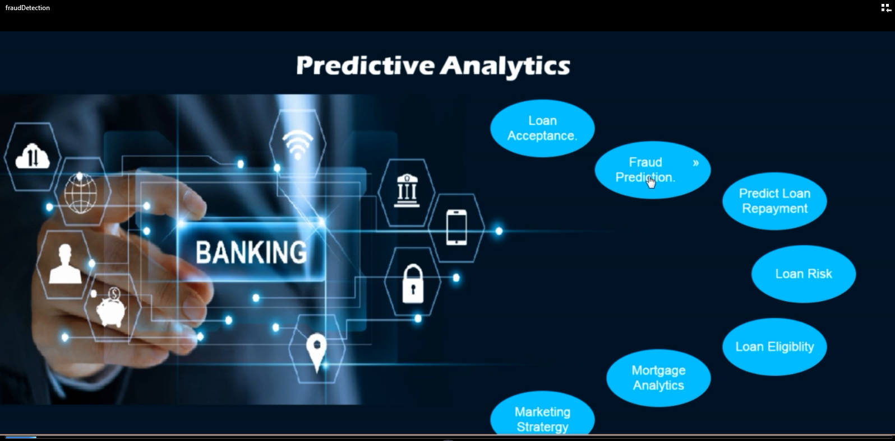
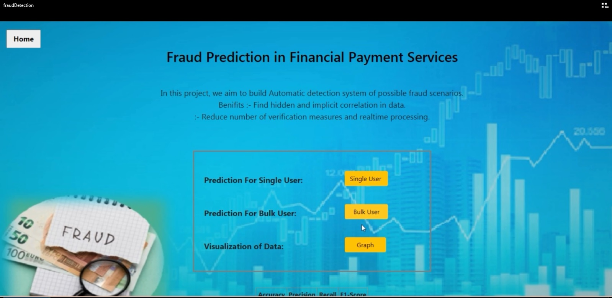
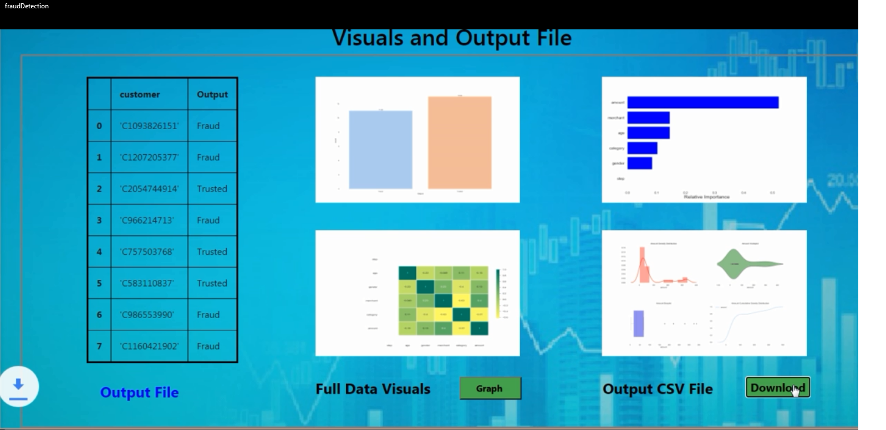
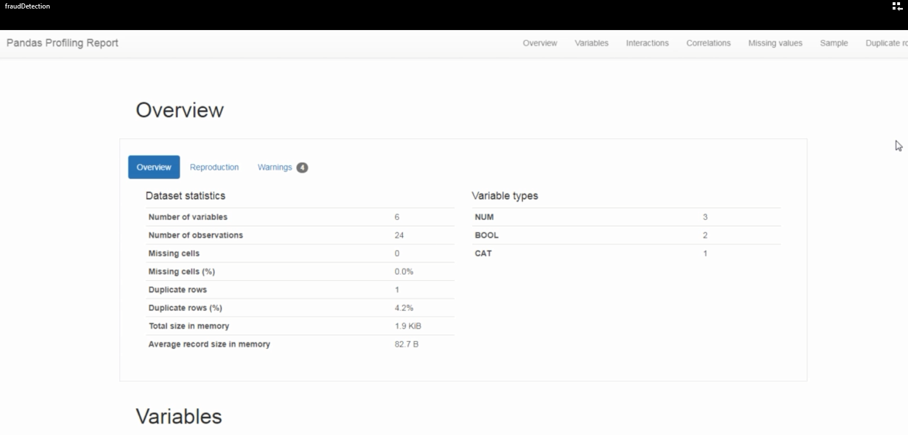

# Smart-Banking Analytics

Smart-Banking Analytics is a banking portal created for predicting different models based on different datasets. This portal includes following predicting models: 

<li> Fraud Detection </li>
<li> Loan Repayment Prediction </li>
<li> Loan Eligibilty Prediction </li>
<li> Mortgage Analytics </li>
<li> Loan Risk Assessment </li> 

Prediction can be performed on one record or on a file containing multiple records. The predicted data is visible on the screen and can be downloaded as an excel file. Moreover, the graphs are displayed in a dashboard to showcase various KPIs. 

[]

### Snapshots of the project
<table> 
  <tr>
    <td width=33% height = 150>  </td> 
    <td width=33% height = 150>  </td>
    <td width=33% height = 150>  </td> 
  </tr>
  <tr>
   <td width=33% height = 150> </td> 
   <td width=33% height = 150> </td>
   <td width=33% height = 150> </td>
  </tr>
 </table>

  
